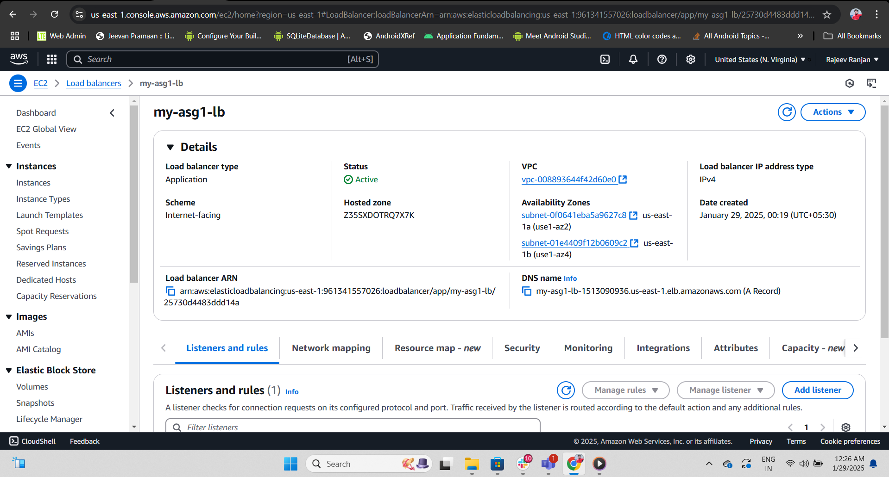

Assignment-1

Objective:
The purpose of this project is to design and implement a scalable and highly available cloud infrastructure to deploy a Spring 3 Hibernate-based application. This infrastructure is designed to meet the following goals:

High Availability: The application will be deployed across multiple private servers to ensure redundancy and fault tolerance.
Scalability: The infrastructure will automatically scale the number of application servers based on traffic demands using Auto Scaling Groups (ASG).
Security: The application will be deployed in a secure environment, using private subnets for the application servers and a load balancer for public access.
Network Isolation: The application will run in a Virtual Private Cloud (VPC), ensuring network isolation and security.
Infrastructure Overview
The architecture is built to ensure that the application can handle varying levels of traffic with minimal downtime and maximum security. The following components are used:

VPC (Virtual Private Cloud): A private network that contains all the necessary infrastructure components. This is the secure network that houses the application resources.

Subnets:

Public Subnet: Houses the Load Balancer (LB) that is accessible from the internet.
Private Subnet: Hosts the application servers (App Servers) that are not directly accessible from the internet.
Load Balancer (LB): Distributes incoming traffic to the application servers in the private subnet. It ensures that the application remains available and can handle high traffic loads by balancing the request load across multiple servers.

Auto Scaling Group (ASG): Automatically adjusts the number of application servers based on demand. This ensures that there are always enough servers to handle the load and that resources are scaled down when not needed, optimizing costs.

Security Groups: These are used to control and manage the traffic flow to and from the Load Balancer and the application servers. The security groups restrict access based on defined rules for increased security.

NAT Gateway: Allows the application servers in the private subnet to access the internet for things like software updates, while still keeping them isolated from the external world.

Key Components and Workflow
Application Deployment:

The Spring 3 Hibernate application is deployed on private servers within the private subnet.
The app servers are launched within an Auto Scaling Group, which allows them to automatically scale based on load.
Traffic Management:

All incoming traffic from users is routed through the Load Balancer (LB), which forwards requests to the appropriate application server based on load distribution.
The Load Balancer ensures high availability by distributing traffic across healthy app servers.
Security:

The Load Balancer is in a public subnet, and only specific ports (e.g., HTTP/HTTPS) are open to the internet.
The private servers in the application layer are not directly accessible from the internet. Only the Load Balancer can access these servers.
Security groups are configured to ensure that only legitimate traffic flows between the components.
Scalability:

The Auto Scaling Group automatically adjusts the number of app servers based on demand. When there’s a spike in traffic, new instances are launched, and when the demand decreases, instances are terminated.
Instructions
Infrastructure Diagram:

A detailed infrastructure diagram is created to visualize the relationships between the various components such as VPC, subnets, Load Balancer, Application Servers, Auto Scaling Group, NAT Gateway, and Security Groups.
Next Steps:

After reviewing the infrastructure diagram, proceed with the implementation of the architecture using the specified AWS services or cloud provider.
Ensure that all components are securely configured, and the application is correctly deployed on the auto-scaled instances

.png)

